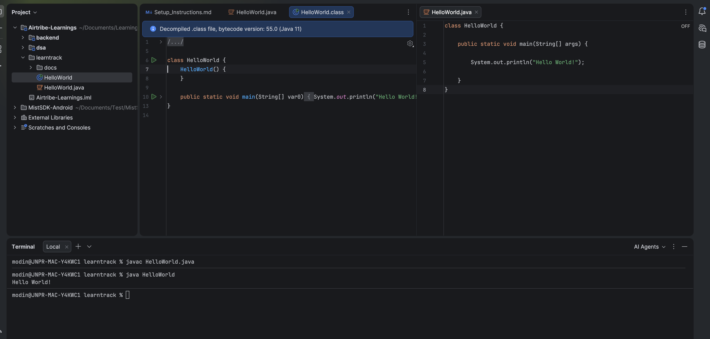

## Installing JDK : 

### Steps which I followed for MAC
   - Open terminal 
   - Run `brew install openjdk` for the latest version (or `brew install openjdk@{version}` for a specific version.)

### My JDK version
   - In terminal run `java -version` to check JDK version 
   - For me it is : "openjdk version "11.0.30" 2026-01-20", which is older as I use my company laptop as of now.

### Print "Hello World!"
  - I created a class having main method [works as entry point for the application]
  - Demonstrated `javac` and `java` commands to compile and run the code
  - Attached the screenshot below
  - 